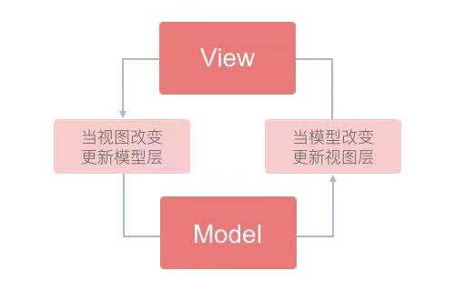
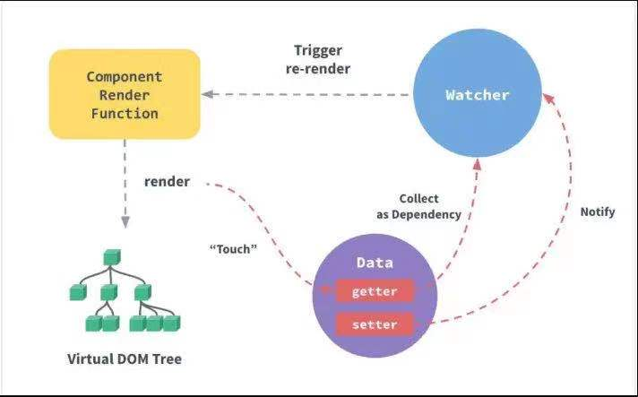
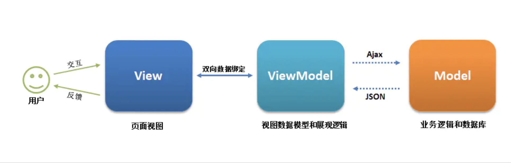

# vue2 进阶

## Vue 注册全局方法

1. 挂载在 Vue.prototype 上面

```js
Vue.prototype.globalXX = "xxx";
```

2. 使用 mixins 采用全局混入的方式

- 创建一个 mixins 文件

```js
const globalMixins = {
  methods: {
    getData() {
      console.log("getData");
    },
  },
};
export default globalMixins;
```

- 在 main.js 中进行全局注册

```js
import Vue from "vue";
import globalMixins from "./mixins/globalMixins";
Vue.mixins(globalMixins);
```

3. 使用 Plugin 方式

```js
const getData = () => {
  console.log("getData");
};
const plugin = {
  install(Vue) {
    Vue.prototype.$getData = getData;
  },
};
export default plugin;
```

- 在 main.js 中进行全局注册

```js
import Vue from "vue";
import plugin from "./plugin/plugin";
Vue.use(plugin);
```

## Vue 双向绑定原理

1. 原理

   View 的变化能实时让 Model 发生变化，而 Model 的变化也能更新到 View。如下图：
   

Vue 采用**数据劫持&发布定于模式的方式**，通过**Object.defineProperty()**，方法来劫持（监控）各属性的 getter，setter，并在数据发生变化时通知订阅者，触发相应的监听回调。

要实现 Vue 的双向绑定大致可以划分是三个模块，如图：


- Observer

  **数据监听器**，负责对数据对象的所有数据进行监听（数据劫持），监听到数据变化通知订阅者。

- Complier

  **指令解析器**，扫描模版，并对指令进行解析，然后绑定指定事件。

- Watcher

  **Watcher 订阅者**，关联**Observer**，和**Complier**，能够订阅并收到属性变动的通知，执行指令绑定的相应操作，更新视图。Update()是他自身的一个方法，用于执行 Compiler 中绑定的回调，更新视图。

模版渲染解析时 Watcher 会对应绑定指令（一对一）。
此时会通过调用订阅者 watcher 初始化（watcher 中的 get 方法），去触发对应属性在发布者 observer 里（Object.defineProperty()）的 getter，Observer 会判断是不是通过 watcher 初始化调用（Dep.target 实例化之后会被清空），只有是才会通过 dep 类依赖收集。

observer 通过 depend 通知 Dep 类收集（addDep 方法，在 watcher 类中，会传入当前 Dep 实例调用本身）当前该订阅者（watcher）中的触发更新的方法，同时第一次初始化 watcher.update()初始化视图。此后每次的数据更新都会通过 oberver 中的 setter 去触发 dep 类中的回调 update 执行收集依赖的所有方法更新订阅者中的状态同时更新视图。

observer 在处理对象和数组的时候，如果是数组，并且调用的方法会改变数组长度，则会重新增加索引之后更新数组，进行重新监听。如果是对象则通过对象的 getter 获取值 setter 更新值。

## 什么是 MVVM

MVVM 源自于经典的 Model–View–Controller（MVC）模式 ，MVVM 的出现促进了前端开发与后端业务逻辑的分离，极大地提高了前端开发效率，MVVM 的核心是 ViewModel 层，它就像是一个中转站（value converter），负责转换 Model 中的数据对象来让数据变得更容易管理和使用，该层向上与视图层进行双向数据绑定，向下与 Model 层通过接口请求进行数据交互，起呈上启下作用。如下图所示：



- View
  View 是视图层，也就是用户界面。前端主要由 HTML 和 CSS 来构建 。

```vue
<template>
  <div>{{ message }}</div>
</template>
```

- Model

Model 是指数据模型，泛指后端进行的各种业务逻辑处理和数据操控，对于前端来说就是后端提供的 api 接口。

```js
export default {
  data() {
    return {
      message: "msg",
    };
  },
};
```

- ViewModel
  ViewModel 是由前端开发人员组织生成和维护的视图数据层。在这一层，前端开发者对从后端获取的 Model 数据进行转换处理，做二次封装，以生成符合 View 层使用预期的视图数据模型。需要注意的是 ViewModel 所封装出来的数据模型包括视图的状态和行为两部分，而 Model 层的数据模型是只包含状态的，比如页面的这一块展示什么，而页面加载进来时发生什么，点击这一块发生什么，这一块滚动时发生什么这些都属于视图行为（交互），视图状态和行为都封装在了 ViewModel 里。这样的封装使得 ViewModel 可以完整地去描述 View 层。

```js
export default {
  data() {
    return {
      message: "msg",
    };
  },
  methods: {
    changeMessage() {
      this.message = "new message";
    },
  },
};
```

## computed 和 watch 的区别

**computed**

computed 是计算属性，依赖其它属性值，并且 computed 的值有缓存，只有它依赖的属性值发生改变，下一次获取 computed 的值时才会重新计算 computed 的值
**watch**
更多的是「观察」的作用，类似于某些数据的监听回调 ，每当监听的数据变化时都会执行回调进行后续操作

运用场景：

- 当我们需要进行数值计算，并且依赖于其它数据时，应该使用 computed，因为可以利用 computed 的缓存特性，避免每次获取值时，都要重新计算
- 当我们需要在数据变化时执行异步或开销较大的操作时，应该使用 watch，使用 watch 选项允许我们执行异步操作 ( 访问一个 API )，限制我们执行该操作的频率，并在我们得到最终结果前，设置中间状态。这些都是计算属性无法做到的

## vue 模版编译过程

## Vue data 为什么必须是函数

因为组件是用来复用的，且 JS 的对象都是引用类型，如果组件中的 data 是一个对象，那么这样作用域没有隔离，子组件中的属性会相互影响，如果组件中的 data 返回的是一个函数那么每个实例，可以维护一份被返回对象的拷贝属性，组件实例之间的 data 属性不会相互影响，而`new Vue`的实例不会被复用，因此不存在引用对象的问题。

## 子组件可以直接改变父组件的数据吗？为什么

不可以，由于 vue 的单向数据流，当子组件改变父组件数据时，Vue 会在浏览器的控制台中发出警告，如果需要修改可以使用`$emit`发射事件，或者使用`.sync`修饰符。

## Vue 的父组件和子组件生命周期钩子函数执行顺序？

Vue 的父组件和子组件生命周期钩子函数执行顺序可以归类为以下 4 部分：

- 加载渲染过程
  父 beforeCreate -> 父 created -> 父 beforeMount -> 子 beforeCreate -> 子 created -> 子 beforeMount -> 子 mounted -> 父 mounted

- 子组件更新过程
  父 beforeUpdate -> 子 beforeUpdate -> 子 updated -> 父 updated

- 父组件更新过程
  父 beforeUpdate -> 父 updated

* 销毁过程
  父 beforeDestroy -> 子 beforeDestroy -> 子 destroyed -> 父 destroyed

## vue 中 key 的作用？为什么不能使用索引作为 key

key 是为 Vue 中 vnode 的唯一标记，通过这个 key，我们的 diff 操作可以更准确、更快速。

- 更准确：因为带 key 就不是就地复用了，在 sameNode 函数 a.key === b.key 对比中可以避免就地复用的情况。所以会更加准确。

- 更快速：利用 key 的唯一性生成 map 对象来获取对应节点，比遍历方式更快，源码如下：

```js
function createKeyToOldIdx(children, beginIdx, endIdx) {
  let i, key;
  const map = {};
  for (i = beginIdx; i <= endIdx; ++i) {
    key = children[i].key;
    if (isDef(key)) map[key] = i;
  }
  return map;
}
```

如果使用了数组的索引，当数组的长度变化时，其索引也会跟着变化，导致标记的 key 会移动位置，此时再通过 sameNode 找到的组件就会出现偏差。
