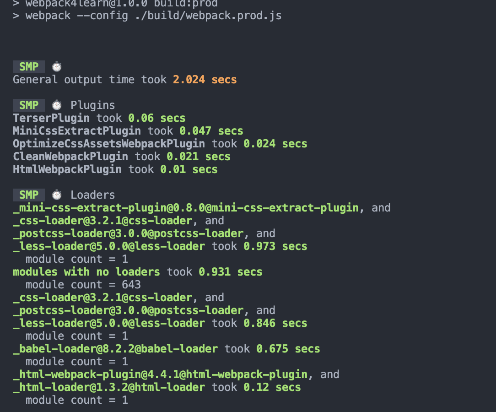

# webpack 性能优化

## tree-sharking

```js
// esmoudule方式
import a from "a";
//commonJs
if (xxx) {
  require("./b");
}
```

**为什么 tree-sharking 必须使用 es-moudle**
因为 commonJS 是动态引入，es-module 是静态引入没有过多的逻辑，在进行打包的时候可以直接对未使用的方法进行过滤。

## 优化 babel-loader

```js
{
    test: /\.js$/,
    use: ['babel-loader?cacheDirectory'], // 开启缓存
    include: path.resolve(__dirname,'src'), // 明确范围
    exclude: path.resolve(__dirname,'node_modules')
}
```

## 开启 css 压缩

[optimize-css-assets-webpack-plugin](https://www.npmjs.com/package/optimize-css-assets-webpack-plugin)

```js
const OptimizeCssAssetsPlugin = require("optimize-css-assets-webpack-plugin");
module.exports = {
  plugins: [
    // 压缩css
    new OptimizeCssAssetsPlugin({}),
  ],
};
```

## 开启 js 压缩

[webpack-parallel-uglify-plugin](https://www.npmjs.com/package/webpack-parallel-uglify-plugin)

```js
const ParallelUglifyPlugin = require("webpack-parallel-uglify-plugin");
module.exports = {
  plugins: [
    // 使用 ParallelUglifyPlugin 并行压缩输出的 JS 代码
    new ParallelUglifyPlugin({
      // 传递给 UglifyJS 的参数
      // （还是使用 UglifyJS 压缩，只不过帮助开启了多进程）
      uglifyJS: {
        output: {
          beautify: false, // 最紧凑的输出
          comments: false, // 删除所有的注释
        },
        compress: {
          // 删除所有的 `console` 语句，可以兼容ie浏览器
          drop_console: true,
          // 内嵌定义了但是只用到一次的变量
          collapse_vars: true,
          // 提取出出现多次但是没有定义成变量去引用的静态值
          reduce_vars: true,
        },
      },
    }),
  ],
};
```

### 使用 SMP 对打包速度进行分析

[speed-measure-webpack-plugin](https://www.npmjs.com/package/speed-measure-webpack-plugin)

```js
const SpeedMeasurePlugin = require("speed-measure-webpack-plugin");
const baseConfig = require("./webpack.base");
const smp = new SpeedMeasurePlugin();
const devConfig = {};
module.exports = smp.wrap(merge(baseConfig, devConfig));
```

**查看结果**


- 使用 IgnorePlugin
  避免引用无用模块
  比如引用`monent`

```js
moddule.exports = {
    plugins: [
        // 已monent为例
        new plugin.IgnorePlugin(/\./locale/, /monent/)
    ]
}
```

## noParse

```js
module.exports = {
  module: {
    noParse: /jquery/,
  },
};
```

## 使用 polyfill

创建`babel.config.js`

`@babel/preset-env`是处理 es6 的一种预设如果是`react`则使用`@babel/preset-react`

`@babel/plugin-transform-runtime`可以重复使用 Babel 的注入助手代码来节省代码大小，按照官网的来配置即可。

[babel 官网](https://www.babeljs.cn/docs/babel-plugin-transform-runtime)

```js
module.exports = {
  presets: ["@babel/preset-env"],
  plugins: [
    [
      "@babel/plugin-transform-runtime",
      {
        absoluteRuntime: false,
        corejs: 3,
        helpers: true,
        regenerator: true,
        version: "7.0.0-beta.0",
      },
    ],
  ],
};
```

说明：比如对 promsie 的补丁在`@babel/plugin-transform-runtime`会自定义一个 promise1（比如），但是在`@balel/pollfy`是直接重写了 promise 这样就会导致一个问题，比如在同一个系统使用了其他方法也有 promise 就会导致出现异常

## resolve

alias和extensions
```js
module.epxorts = {
    resolve: {
        extensions: ['.js', '.json', '.vue'],
        alias: {
            "@": path.resolve(__dirname, "src")
        }
    }
}
```

## webpack 一些工具

打包进度
[progress-bar-webpack-plugin](https://www.npmjs.com/package/progress-bar-webpack-plugin)

通知
[webpack-build-notifier](https://www.npmjs.com/package/webpack-build-notifier)

分析工具，可以让你知道你打包之后每个文件的大小
[webpack-bundle-analyzer](https://www.npmjs.com/package/webpack-bundle-analyzer)

## 更多好玩的 webpack 插件

[webpack-dashboard](https://www.npmjs.com/package/webpack-dashboard)
[inline-manifest-webpack-plugin](https://www.npmjs.com/package/inline-manifest-webpack-plugin)
[copy-webpack-plugin](https://www.npmjs.com/package/copy-webpack-plugin)

## module，chunk，bundle 的区别

- module 各个源码文件，webpack 中一切皆模块
- chunk 多模块合并而成，比如在 entry，import()，splitChunk
- bundle 最后打包输出的文件

**IgnorePlugin 和 noParse 区别**

- IgnorePlugin 直接不引入，代码中没有
- noParse，引入，但不打包
